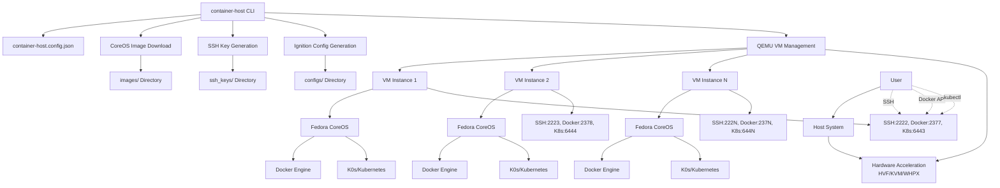
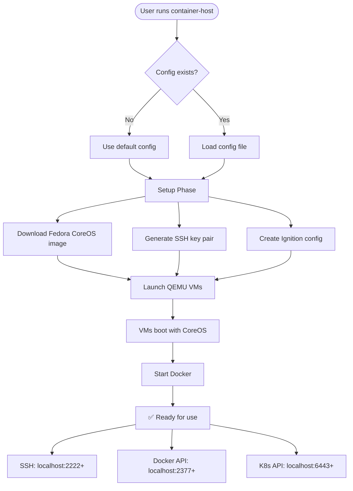

# container-host
A Go-based tool for creating and managing Fedora CoreOS virtual machines with Docker and Kubernetes support using QEMU.


## How It Works



## Quick Start

Install and run container-host using your preferred Node package manager:

```bash
# Using npm
npx container-host-cli [options]

# Using yarn
yarn dlx container-host-cli [options]

# Using pnpm
pnpm dlx container-host-cli [options]

# Using bun
bunx container-host-cli [options]

# Or install globally
npm install -g container-host-cli
container-host [options]
```

The CLI automatically downloads the appropriate binary for your platform and architecture.

## Overview

container-host automates the setup of Fedora CoreOS VMs with pre-configured Docker Engine and Kubernetes (K0s) support. It handles VM image downloads, SSH key generation, Ignition configuration, and multi-instance deployments across different architectures.

## Features

- **Multi-architecture support**: x86_64, aarch64, and other QEMU-supported architectures
- **Automated VM provisioning**: Downloads CoreOS images and configures VMs automatically
- **Docker integration**: Pre-configured Docker Engine with TCP API access
- **Kubernetes ready**: K0s integration with exposed API endpoints
- **Multi-instance deployment**: Run multiple VM instances with port forwarding
- **Cross-platform**: Works on macOS (HVF), Linux (KVM), and Windows (WHPX)
- **SSH key management**: Automatic SSH key pair generation and deployment
- **Ignition configuration**: Automated CoreOS Ignition config generation

## Prerequisites

- **Go**: Version 1.24 or later
- **QEMU**: System-appropriate QEMU installation
  - macOS: `brew install qemu`
  - Ubuntu/Debian: `apt install qemu-system`
  - Windows: Install QEMU from official website
- **Hardware acceleration** (recommended):
  - macOS: Hypervisor Framework (built-in)
  - Linux: KVM support
  - Windows: Hyper-V or WHPX

## Installation

```bash
git clone <repository-url>
cd container-host
make build
```

## Configuration

Create `container-host.config.json` to customize your deployment:

```json
{
  "vm": {
    "architecture": "aarch64",
    "version": "42.20250803.3.0",
    "memory": "4096",
    "cpus": "4",
    "instances": 1
  },
  "network": {
    "sshPort": "2222",
    "dockerPort": "2377",
    "kubernetesPort": "6443"
  },
  "qemu": {
    "enableAcceleration": true,
    "customArgs": []
  }
}
```

### Configuration Options

| Section | Field | Default | Description |
|---------|-------|---------|-------------|
| vm | architecture | aarch64 | Target architecture (aarch64, x86_64) |
| vm | version | 42.20250803.3.0 | Fedora CoreOS version |
| vm | memory | 4096 | RAM in MB per instance |
| vm | cpus | 4 | CPU count per instance |
| vm | instances | 1 | Number of VM instances to create |
| network | sshPort | 2222 | Base SSH port (incremented per instance) |
| network | dockerPort | 2377 | Base Docker API port |
| network | kubernetesPort | 6443 | Base Kubernetes API port |
| qemu | enableAcceleration | true | Use hardware acceleration |

## Usage

### Basic Usage

Start a single VM with default configuration:

```bash
make run
```

### Custom Architecture and Version

```bash
./container-host -arch x86_64 -version 41.20240101.1.0
```

### Connect to Your VM

Once started, the VM provides several connection methods:

```bash
# SSH access
ssh -p 2222 core@localhost

# Docker API access
export DOCKER_HOST=tcp://localhost:2377
docker ps

# Kubernetes API (if K0s is configured)
kubectl --server=https://localhost:6443 get nodes
```

### Multiple Instances

Configure multiple instances in `container-host.config.json`:

```json
{
  "vm": {
    "instances": 3
  }
}
```

This creates 3 VMs with incremented ports:
- Instance 1: SSH 2222, Docker 2377
- Instance 2: SSH 2223, Docker 2378  
- Instance 3: SSH 2224, Docker 2379

## Directory Structure

```
container-host/
├── configs/           # Ignition configurations
├── images/           # Downloaded CoreOS images
├── ssh_keys/         # Generated SSH key pairs
├── main.go           # Main application
├── coreos_download.go # Image download logic
└── container-host.config.json # Configuration file
```

## Architecture Support

The tool automatically detects and configures QEMU for your target architecture:

- **aarch64**: Uses `qemu-system-aarch64` with ARM64 EFI firmware
- **x86_64**: Uses `qemu-system-x86_64` with OVMF firmware
- **Custom**: Supports any QEMU-compatible architecture

## Networking

Each VM instance exposes:

| Service | Default Port | Purpose |
|---------|--------------|---------|
| SSH | 2222+ | Remote shell access |
| Docker API | 2377+ | Container management |
| HTTP | 80+ | Web services |
| Kubernetes API | 6443+ | K8s cluster access |
| K0s API | 9443+ | K0s management |
| VNC | 5900+ | Graphical console |

## Development

### Building from Source

```bash
go build -o container-host *.go
```

### Cleaning Up

```bash
# Remove binary
make clean

# Reset VMs and SSH keys
make clean_vm
```

## Troubleshooting

### Common Issues

**QEMU binary not found**
- Ensure QEMU is installed and in PATH
- Check architecture-specific binary names

**Permission denied on SSH keys**
- SSH keys are auto-generated with correct permissions
- Check `ssh_keys/` directory exists

**VM fails to start**
- Verify hardware acceleration is available
- Check QEMU logs for detailed errors
- Try disabling acceleration in config

**Docker connection refused**
- Wait for VM to fully boot (30-60 seconds)
- Verify Docker service is running: `ssh -p 2222 core@localhost 'sudo systemctl status docker'`

### Debug Mode

Enable verbose logging:

```json
{
  "debug": {
    "printIgnitionConfig": true,
    "verbose": true
  }
}
```

## Related Documentation

- [KUBERNETES.md](KUBERNETES.md) - Kubernetes cluster setup guide
- [Fedora CoreOS Documentation](https://docs.fedoraproject.org/en-US/fedora-coreos/)
- [Ignition Configuration](https://coreos.github.io/ignition/)

## Legal Notice and Disclaimers

### Limitation of Liability

**IMPORTANT: container-host-cli manages system-level resources including virtual machines, network interfaces, and processes. Use at your own risk.**

THE SOFTWARE IS PROVIDED "AS IS", WITHOUT WARRANTY OF ANY KIND, EXPRESS OR IMPLIED, INCLUDING BUT NOT LIMITED TO THE WARRANTIES OF MERCHANTABILITY, FITNESS FOR A PARTICULAR PURPOSE AND NONINFRINGEMENT. IN NO EVENT SHALL THE AUTHORS OR COPYRIGHT HOLDERS BE LIABLE FOR ANY CLAIM, DAMAGES OR OTHER LIABILITY, WHETHER IN AN ACTION OF CONTRACT, TORT OR OTHERWISE, ARISING FROM, OUT OF OR IN CONNECTION WITH THE SOFTWARE OR THE USE OR OTHER DEALINGS IN THE SOFTWARE.

### System-Level Operations Warning

This tool performs system-level operations that may:
- Consume significant system resources (CPU, memory, disk space, network bandwidth)
- Modify network configurations and create network interfaces
- Create and manage virtual machine processes with elevated privileges
- Download and execute third-party software (CoreOS images, containers)
- Manage SSH keys and cryptographic materials
- Expose network services on your system

**Users are responsible for:**
- Understanding the security implications of running virtual machines
- Implementing appropriate network security measures
- Monitoring resource usage and system impact
- Ensuring compliance with organizational security policies
- Securing SSH keys and access credentials

### Third-Party Dependencies

This tool relies on external dependencies and services:
- **Fedora CoreOS Images**: Downloaded from official Fedora servers
- **QEMU**: System virtualization software
- **Docker**: Container runtime and API
- **Kubernetes (K0s)**: Container orchestration platform

Users should review the security and licensing terms of these dependencies independently.

### Export Control Compliance

This software may be subject to export control regulations. Users are responsible for ensuring compliance with applicable export control laws in their jurisdiction.

### Data Privacy

Virtual machines created by this tool may process, store, or transmit sensitive data. Users are responsible for:
- Implementing appropriate data protection measures
- Ensuring compliance with privacy regulations (GDPR, CCPA, etc.)
- Securing VM instances and their data
- Managing data retention and deletion

## License

This project is licensed under the MIT License - see the [LICENSE](LICENSE) file for details.

**Copyright (c) 2025 Geoff Seemueller**

The MIT License is a permissive license that allows commercial and private use, modification, and distribution. However, it provides no warranty and limits liability. See the full license text for complete terms.

## Contributing

Please read [CONTRIBUTING.md](CONTRIBUTING.md) for detailed guidelines on:

- Code of conduct and community standards
- Development setup and processes  
- Legal requirements for contributors
- Security considerations for contributions
- Testing and documentation requirements

### Security Issues

If you discover security vulnerabilities, please report them responsibly: [Security Policy](SECURITY.md). **Do not report security issues through public GitHub issues.**